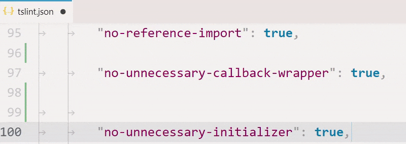
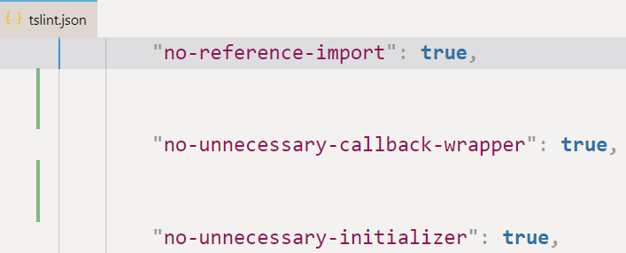

### Provides 2 commands

* `remove-empty-lines.inDocument` - Removes empty lines in the entire document
* `remove-empty-lines.inSelection` - Removes empty lines in selection. Can be used without selection (will remove all adjacent empty lines)




### Settings

* `remove-empty-lines.allowedNumberOfEmptyLines`

Example: `"remove-empty-lines.allowedNumberOfEmptyLines": 1,`



# ⚠⚠⚠ Extension doesn't define any keyboard shortcuts

[📚 How to open keybindings.json =======>](https://stackoverflow.com/a/45384050/5590193)

### DEMO: Pass allowed number of empty lines as arguments in `keybindings.json`

```js
{
	"key": "ctrl+shift+9",
	"command": "remove-empty-lines.inDocument",
	"args": 0
},
{
	"key": "ctrl+shift+9",
	"command": "remove-empty-lines.inSelection",
	"when": "editorHasSelection",
	"args": 0
},
{
	"key": "ctrl+shift+8",
	"command": "remove-empty-lines.inDocument",
	"args": 1
},
{
	"key": "ctrl+shift+8",
	"command": "remove-empty-lines.inSelection",
	"when": "editorHasSelection",
	"args": 1
},
```